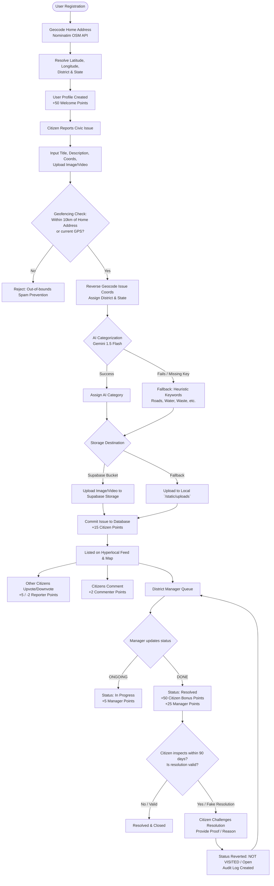

# 🏙️ Community Hero (Vibe2Ship)

An AI-driven, gamified, hyperlocal civic issue tracking and governance platform designed to bridge the communication gap between citizens and local authorities. Utilizing geofenced verification, hierarchical governance tiers, and Google's Generative AI, Community Hero ensures that civic complaints are accurately classified, locally validated, and transparently resolved.

---

## 🗺️ System Workflow Diagram

The flowchart below demonstrates the citizen reporting journey, geofence validation, AI classification, government resolution, and the 90-day citizen validation loop:



---

## 🏆 Alignment with the Evaluation Matrix

| Criteria | Weightage | Community Hero Implementation Details |
| :--- | :---: | :--- |
| **Problem Solving & Impact** | **20%** | Solves civic apathy and local administrative delays. Introduces geofenced verification to completely eliminate out-of-jurisdiction spam. Closes the accountability loop by giving citizens a **90-day challenge window** to veto fake resolutions. |
| **Agentic Depth** | **20%** | Integrates **Google Gemini 1.5 Flash** for understanding and classifying unstructured text. Includes graceful degradations: if Gemini is rate-limited or fails, a local regex-based heuristic engine handles classification. If cloud storage (Supabase) fails, the app seamlessly falls back to local storage. |
| **Innovation & Creativity** | **20%** | Features a multi-role gamification points system. Citizens earn points for reporting (+15) and commenting (+2), and their reputation scales with community upvotes (+5) or downvotes (-2). District managers are incentivized via resolution bonuses (+25), creating alignment between public needs and official duties. |
| **Usage of Google Technologies** | **15%** | Utilizes **Google Cloud Run** for containerized serverless hosting, offering immediate scaling and high availability. Uses **Gemini 1.5 Flash** via the official Google Generative AI SDK for real-time natural language classification. |
| **Product Experience & Design** | **10%** | Delivers role-based dashboard experiences for four distinct tiers (Citizen, District Manager, State Manager, Admin). The interface features interactive maps, clean statistical charts, real-time upvoting, and a detailed audit log (`UpdateLog`) tracking status changes. |
| **Technical Implementation** | **10%** | Built with Python Flask, SQLAlchemy, and Flask-Login. Uses PostgreSQL (Supabase) in production and SQLite in development. Employs Nominatim OpenStreetMap API for automated forward and reverse geocoding to resolve districts. |
| **Completeness & Usability** | **5%** | Features automatic database schema creation and a detailed mock seeder database out-of-the-box. Developers can immediately run the application, log in with pre-configured roles across three states, and inspect the maps. |

---

## 🚀 Key Features

### 1. Hyperlocal Geofenced Reporting
* **Address Resolution**: During registration, a citizen enters their home address, which is geocoded to an exact coordinate using Nominatim OpenStreetMap.
* **10 KM Guardrail**: Citizens can only report issues located within 10 km of their home address or their current GPS location. This prevents spam, out-of-bounds complaints, and coordinate manipulation.

### 2. Hierarchical Governance Portals
* **Citizen**: Report issues, view interactive maps, upvote/downvote, comment on issues, and challenge incorrect resolutions.
* **District Manager**: Authorized to update the government status of issues (`NOT VISITED`, `ONGOING`, `DONE`) specifically in their assigned district.
* **State Manager**: Visualizes completion rates and total issues across all districts in the state; creates and assigns District Managers.
* **Admin**: Universal dashboard enabling the inspection of all states/districts and creation of State Managers.

### 3. Google Gemini Auto-Categorization
* Automatically parses complaint titles and descriptions to categorize them into standard folders: `Roads`, `Water & Sewerage`, `Waste Management`, `Streetlights`, `Utilities`, or `Other`.

### 4. Interactive Gamification
* Citizen points dictate their rank on the local leaderboard.
* Feedback loop: Reporting an issue awards +15 points. Upvotes from the community award +5 points to the reporter. When a manager resolves the issue (`DONE`), the reporter receives a +50 bonus points incentive.

### 5. 90-Day Challenge (Veto) Window
* If a District Manager marks an issue as `DONE`, but the problem is not resolved in reality, the original reporter has 90 days to challenge it. Challenging instantly reverts the status to `NOT VISITED` and creates an audit log entry.

---

## 🛠️ Robustness & Error Tolerance

* **Generative AI Fallback**: If the Gemini API key is missing or fails due to network issues/rate limits, a keyword-based heuristic rules engine classifies the issue so reporting is never blocked.
* **Storage Redundancy**: If the Supabase media bucket connection fails, the application automatically redirects file streams to write to the local server storage `/static/uploads`.
* **Geocoding Resilience**: If forward or reverse geocoding services fail, the system defaults coordinates to the state capital (Bangalore Urban, Karnataka) instead of crashing, preserving the user session.
* **Database Portability**: The database URI parser automatically detects the prefix (`postgres://` vs `postgresql://`) to maintain compatibility between Supabase DB schemas and SQLAlchemy requirements.

---

## 📂 Project Structure

```
├── app.py                # Main application file containing Flask routes, API, and seeding
├── models.py             # SQLAlchemy schemas (User, Issue, Comment, Vote, UpdateLog)
├── Dockerfile            # Containerization configuration for Google Cloud Run
├── deploy.bat            # Windows deployment script for Google Cloud Run (gcloud CLI)
├── render.yaml           # Deployment configuration for Render platform
├── requirements.txt      # Python dependencies
├── static/               # CSS styles, map components, and local media uploads
└── templates/            # HTML templates for dashboards, maps, and login screens
```

---

## 💻 Local Setup & Development

1. **Clone the Repository & Install Dependencies**:
   ```bash
   pip install -r requirements.txt
   ```

2. **Configure Environment Variables**:
   Create a `.env` file in the root directory:
   ```env
   SECRET_KEY=your_secret_key
   DATABASE_URL=sqlite:///community_hero.db
   GEMINI_API_KEY=your_google_gemini_api_key
   SUPABASE_URL=your_supabase_url
   SUPABASE_KEY=your_supabase_anon_key
   ```

3. **Initialize the Database**:
   Run the CLI command to build the tables and seed mock data:
   ```bash
   flask init-db
   ```

4. **Run the Server**:
   ```bash
   python app.py
   ```
   Open `http://127.0.0.1:5000` in your web browser.

---

## 👥 Seeded Mock Credentials

For instant demonstration, use the following credentials to access different roles:

* **Admin**: `admin` / `password123`
* **State Manager (Karnataka)**: `state_mgr_karnataka` / `password123`
* **District Manager (Bangalore)**: `dist_mgr_blr` / `password123`
* **Citizen**: `citizen_alex` / `password123`
